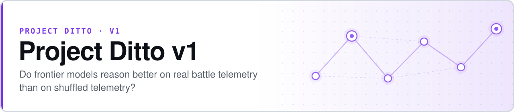

<p align="center">
  <picture>
    <source media="(prefers-color-scheme: dark)" srcset="assets/banner-dark.svg">
    
  </picture>
</p>

# Project Ditto v1

**Do frontier models reason better on real decision telemetry than on shuffled versions of the same telemetry?**

Project Ditto v1 is an evaluation-only research prototype. It translates real Pokémon Showdown battles into abstract **constraint chains**, produces seeded shuffled controls from the same source matches, and measures whether a model predicts the next constraint more accurately on the real chain than on its shuffled twin. The gap between the two is the effect of interest.

- **Pre-registered before scoring** — the success threshold (gap ≥ 0.05 at *p* < 0.05) was fixed in the spec, not chosen after seeing results
- **Domain-blind by construction** — chains render to abstract English with zero Pokémon vocabulary, enforced by an automated leakage check
- **Paired by design** — every real chain has shuffled variants built from the same match, so inference is paired and within-match
- **Cheap to reproduce** — synthetic data generation runs offline, and the full evaluation is a few dollars on the Batches API


**[Spec](showdown%20prototype%20spec%20v1.pdf)** · **[Results](RESULTS.md)** · **[Corrected scoring](CORRECTED_SCORING.md)** · **[Architecture](CLAUDE.md)**

```bash
pip install -r requirements.txt
python scripts/generate_synthetic_data.py --n 2500 --out data/raw/
python -m src.runner --model haiku --chains chains/real/ --seed 42 --dry-run --n 5
```

## Headline result

| Model | Gap (real − shuffled) | Bonferroni-corrected *p* | Tier |
|---|---:|---:|---|
| Claude Sonnet 4.6 | **+0.206** | ≪ 10⁻²¹² | strong-positive |
| Claude Haiku 4.5 | **+0.066** | ≪ 10⁻²⁵ | moderate-positive |

Both clear the pre-registered minimum publishable threshold by a wide margin.

### Methodology correction (April 2026)

A post-hoc review found that the original scoring applied **unpaired** tests — a two-sample proportion *z*-test for Layer 1, Welch's *t* for Layer 2 — to data that is inherently paired, since each real chain has shuffled variants derived from the same source match. The review also found no multiple-comparisons correction across the two model cells.

The corrected analysis applies McNemar's test (Layer 1), a paired *t*-test (Layer 2), and Bonferroni correction across both cells. **Both findings survive unchanged.** The correction does not alter the qualitative or quantitative headline; it supplies statistically appropriate inference for paired data.

Implementation: [`src/scorer_corrected.py`](src/scorer_corrected.py) · full comparison: [`CORRECTED_SCORING.md`](CORRECTED_SCORING.md)

## How it works

| Stage | Module | What happens |
|---|---|---|
| **Parse** | `src/parser.py` | Showdown protocol text → `BattleLog` / `BattleEvent`; filters to Elo ≥ 1700, ≥ 15 turns, Gen 9 OU |
| **Translate** | `src/translation.py` | Events → six typed constraint objects. Frozen at tag `T-v1.1-frozen` |
| **Observe** | `src/observability.py` | Opponent units hidden until revealed; opponent HP bucketed to 0/25/50/75/100% |
| **Filter** | `src/filter.py` | Chain validity: length 20–40, ≥ 2 sub-goal transitions, monotonic timestamps |
| **Shuffle** | `src/shuffler.py` | Seeded permutation preserving monotonic timestamps — the control condition |
| **Render** | `src/renderer.py` | Abstract English; `check_pokemon_leakage()` enforces zero domain vocabulary |
| **Evaluate** | `src/runner.py` | Anthropic Batches API at a mid-chain cutoff, K = `len(constraints) // 2` |
| **Score** | `src/scorer.py` | Layer 1 top-3 match, Layer 2 legality × optimality, Layer 3 subsets |

### The six constraint types

`ResourceBudget` · `ToolAvailability` · `SubGoalTransition` · `InformationState` · `CoordinationDependency` · `OptimizationCriterion`

These carry through every later version of the program unchanged, which is what makes cross-domain comparison possible.

### Pipeline

```
data/raw/*.jsonl  →  scripts/build_chains.py  →  chains/real/ + chains/shuffled/
                                                       ↓
                  scripts/build_reference.py  →  data/reference_dist.pkl
                                                       ↓
                          src/runner.py        →  results/raw/ + results/blinded/
                                                       ↓
                          src/scorer.py        →  results/scored.json
```

## Quick start

```bash
pip install -r requirements.txt

# Synthetic data — no internet, no API key
python scripts/generate_synthetic_data.py --n 2500 --out data/raw/

# Build chains and the reference action distribution
python scripts/build_chains.py --data data/raw/ --out-real chains/real/ --out-shuffled chains/shuffled/
python scripts/build_reference.py build-raw --raw data/raw/ --out data/reference_dist.pkl

# Dry-run evaluation — still no API key
python -m src.runner --model haiku --chains chains/real/ --seed 42 --dry-run --n 5

# Full evaluation — requires ANTHROPIC_API_KEY in .env
python -m src.runner --model haiku --chains chains/real/ --seed 42
python -m src.runner --model opus  --chains chains/real/ --seed 42

pytest tests/
```

> **Synthetic data is for pipeline development only.** It is structurally valid but not semantically meaningful. Acquire real data before drawing any conclusion.

## Invariants

These hold across the whole program, and breaking one invalidates the pre-registration:

- **T is frozen.** `src/translation.py` and `src/renderer.py` must not change after the `T-v1.1-frozen` tag.
- **The scorer is blinded.** Scoring runs in a separate session that never sees model identity, the real/shuffled label, or the seed.
- **No domain vocabulary leaks into rendered chains.** Unit-tested via `check_pokemon_leakage()`.
- **Cutoff K = `len(constraints) // 2`** unless explicitly overridden.

## The Ditto program

| Version | Domain | Headline |
|---|---|---|
| **v1** ⟵ *you are here* | **Pokémon Showdown telemetry** | **Sonnet +0.206 · Haiku +0.066** |
| [v2](https://github.com/safiqsindha/Project-Ditto-v2) | Programming agent trajectories | Partial reproduction |
| [v3](https://github.com/safiqsindha/Project-Ditto-V3) | Chess · Chess960 · checkers · draughts | Phase 1 complete, paused at Gate 8 |
| [v4](https://github.com/safiqsindha/Project-Ditto-V4) | Pokémon, as a methodology control | +0.131, strong-positive |
| [v4.5](https://github.com/safiqsindha/Ditto-V4.5--DeepSeek-Flash-test) | DeepSeek V4 Flash cross-model probe | Scoping stub |
| [v5](https://github.com/safiqsindha/Ditto-V5) | PUBG · NBA · CS:GO · Rocket League · poker | 4-tier hierarchy, closed |
| [v5.1](https://github.com/safiqsindha/Ditto-5.1) | 22-model cross-provider panel | Near-chance across the panel |
| [v5.2](https://github.com/safiqsindha/Ditto-5.2-diagostic) | Diagnostic kit for the v5.1 null | Pre-registered, in progress |
| [v5.4](https://github.com/safiqsindha/DITTO-V5.4-OLAT) | 24 inference levers, two DeepSeek models | 6 meaningful conditions |

## License

[MIT](LICENSE) — free to use, modify, and distribute.
